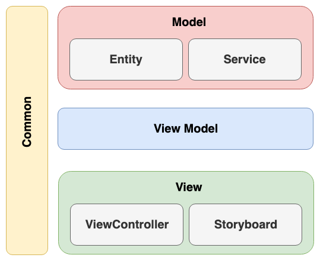

# Arquitetura MVVM Swift

[](https://travis-ci.org/ranzate/arquitetura-mvvm-swift)

Projeto base utilizando a arquitetura MVVM com Swift 4, RxSwift, RxCocoa, RxDatasource e Alamofire.

## Detalhamento da arquiteura

A arquitetura desse projeto se baseia em 3 camadas, Model, View e ViewModel.

## Model
Essa camadas é dividade entre as classes Entity e Service. 

### Entity

As classes Entity são a representação das informações obtidas atraves de serviços externos (API's) e serviços locais (Banco de dados). Abaixo segue um exemplo de uma implementação de uma classe Entity:

```swift
class Post: Codable {
    var userId: Int!
    var id: Int!
    var title: String!
    var body: String!
    
    init() {
    }
    
    required init(from decoder: Decoder) throws {
        let container = try decoder.container(keyedBy: CodingKeys.self)
        userId = try container.decodeIfPresent(Int.self, forKey: .userId) ?? 0;
        id = try container.decodeIfPresent(Int.self, forKey: .id) ?? 0
        title = try container.decodeIfPresent(String.self, forKey: .title) ?? ""
        body = try container.decodeIfPresent(String.self, forKey: .body) ?? ""
    }
    
    enum CodingKeys: String, CodingKey {
        case userId
        case id
        case title
        case body
    }
}
```

### Service

As classes services são dividas entre Remotas e Locais. As classes remotas tem como o objetivo se comunicar com provedores externos do aplicativo (ex: API). Já as classes locais são responsáveis por fazer a comunicação com provedores internos do aplicativo (ex: Banco de dados). Abaixo segue um exemplo de classe remota:

```swift
class PostRemoteService: BaseRemoteService {

    func getPosts() -> Observable<[Post]> {
        return request(Endpoints.Posts.list.url, method: .get, parameters: nil, encoding: encoding)
    }

    func getPost(_ id: Int) -> Observable<Post?> {
        return request(Endpoints.Posts.get(id).url, method: .get, parameters: nil, encoding: encoding)
    }
}
```

## View Model

A camada ViewModel tem o papel de notificar para camada View todas vez que uma Model é atualizada. Ela também é responsável por qualquer tratamento de dados necessário para apresentação na View. Segue abaixo um exemplo de implementação de uma classe View Model:

```swift
class PostViewModel : BaseViewModel {

    private var service = PostRemoteService()

    var posts = BehaviorRelay<[Post]>(value: [Post]())
    var post = BehaviorRelay<Post?>(value: nil)

    func getPosts() {
        service.getPosts()
            .subscribe(onNext: { (posts) in
                self.posts.accept(posts)
            }, onError: { (error) in
                self.error.accept(error.getMessage())
            }).disposed(by: disposeBag)
    }
    
    func getPostIdSelected(_ index: Int) -> Int {
        return posts.value[index].id
    }

    func getViewModelCell(_ index: Int) -> PostTableViewCellViewModel {
        if posts.value.count > index {
            return PostTableViewCellViewModel(posts.value[index])
        }
        return PostTableViewCellViewModel(nil)
    }
}
```

## View

Camada reponsável pela UI da aplicação, essa camada é composta por ViewController's e Storyboard's.

## Modelo lógico

